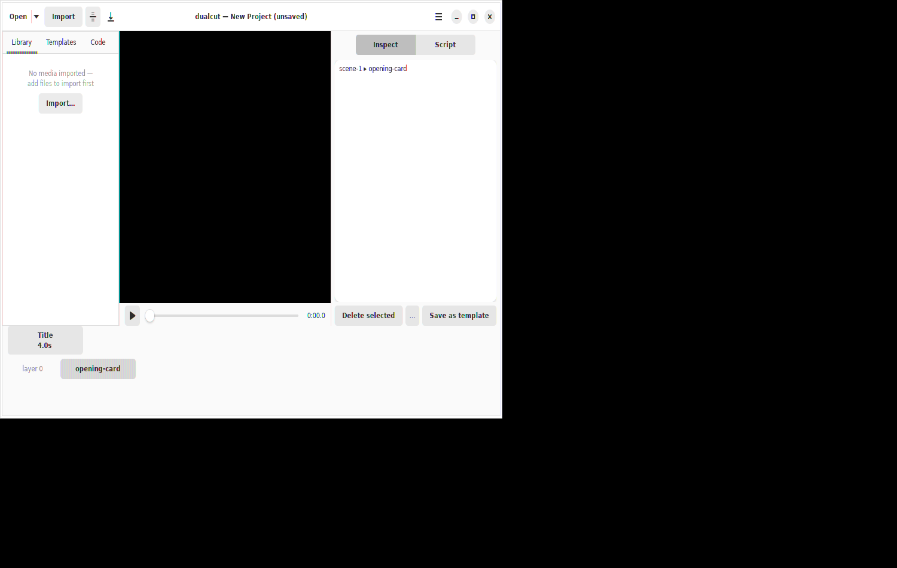
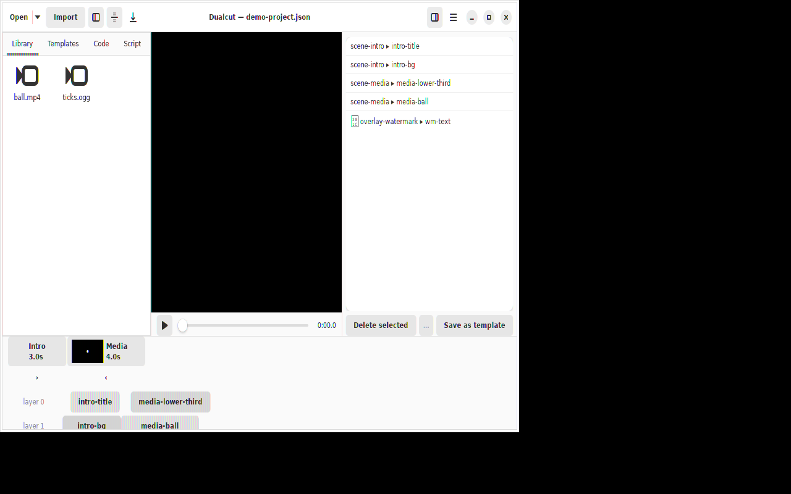
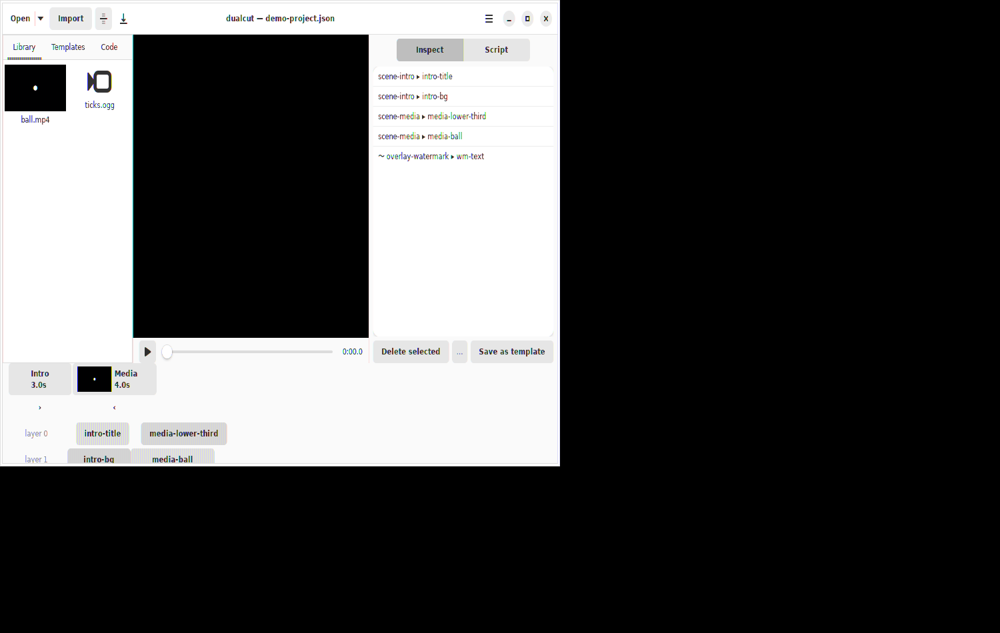
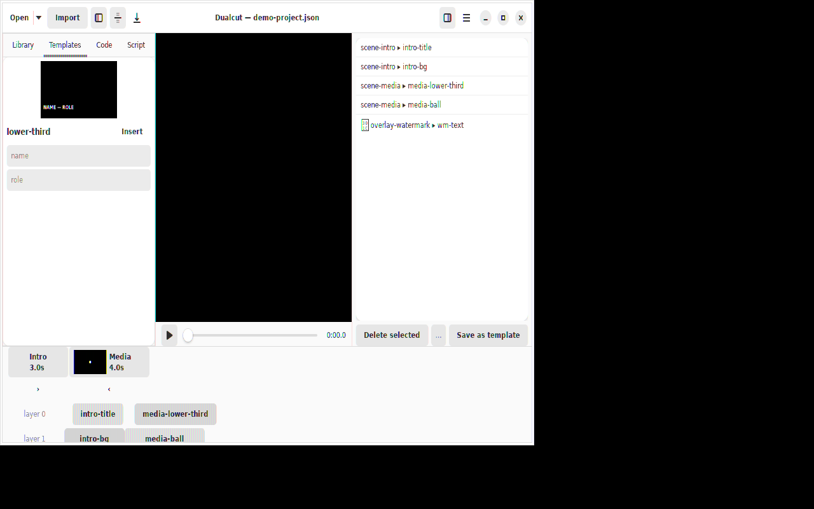
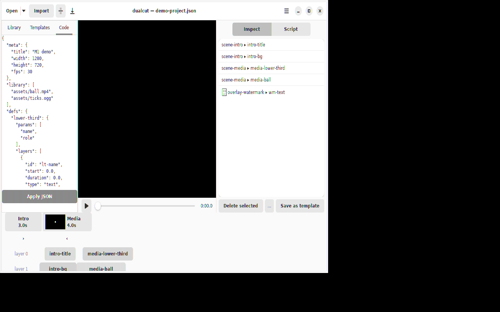
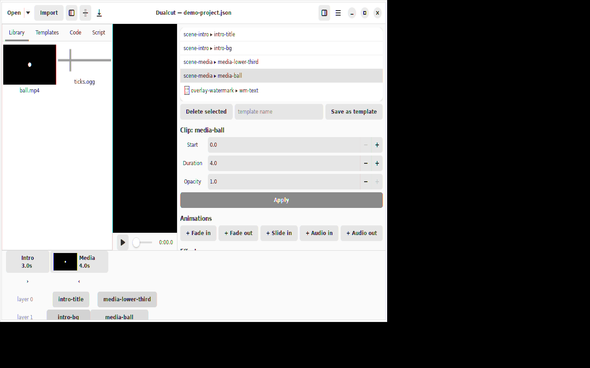
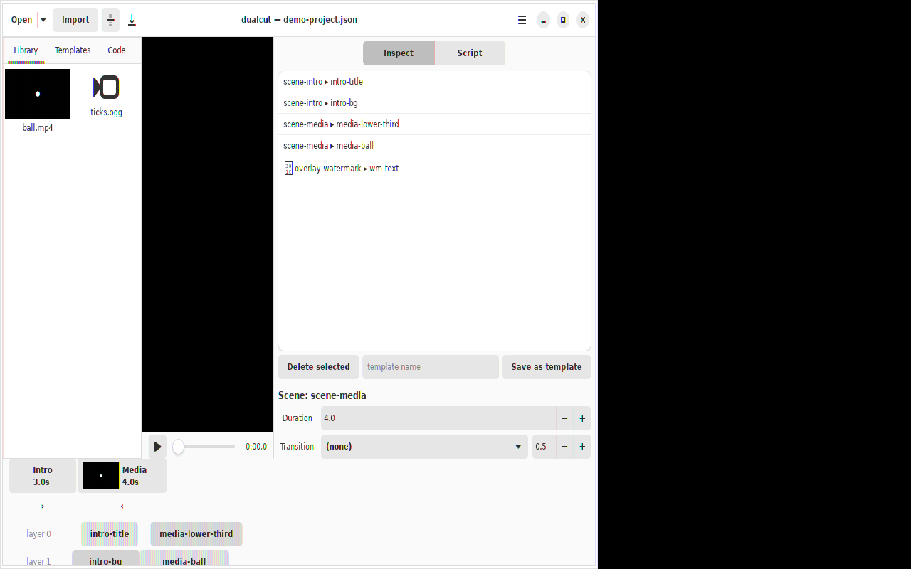
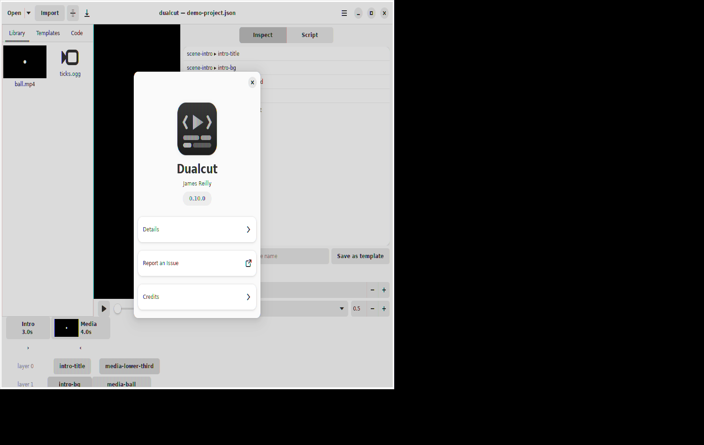

# Dualcut User Guide

Screenshots on this page are regenerated automatically on every release
by `scripts/walkthrough.sh` (the app's `DUALCUT_WALKTHROUGH` mode), so
they always match the released build.

## Starting out

Launch Dualcut from your app menu and you get an unsaved **New
Project**, scaffolded with a title scene — edit immediately, then pick
a location with *Menu → Save Project As…* (auto-save takes over from
there). Use **Open** for an existing project (the arrow lists recent
ones), or pass a path on the command line: `dualcut project.json`.

## The editor

One window, four regions: the **Library / Templates / Code / Script**
tabs on the left, the **preview** with transport controls in the
middle, the **Inspector** (parameters for whatever is selected) on the
right, and the **timeline** in a bottom pane you can toggle from the
header bar.

Transport shortcuts: **Space** play/pause, **←/→** frame-step,
**Home** rewind, **Ctrl+Z / Ctrl+Shift+Z** undo/redo.

## Library

**Import** (header or the Library tab's empty state) adds media files
to the project's library — or just drag files from your file manager
and drop them anywhere on the window. Double-click a thumbnail to insert it into
the scene under the playhead; right-click for *Add to Timeline* /
*Remove from Library*.

## Templates

Every reusable composition (def) in the project appears here with a
rendered preview. Fill in the parameter fields and press *Insert* to
instantiate it at the playhead. Ship your own by selecting clips and
using *Save as template*.

## Code view

The live project JSON — the document itself. Edit it directly and
press *Apply JSON*; the change is validated, undoable, and hot-reloads
the preview, exactly as if an agent had edited the file on disk.

## Script

Where Code shows the document, Script *transforms* it: write a
TypeScript function `export function edit(project: Project): Project`,
press *Run script*, and the returned project becomes the new document
(undoable like any other edit). Useful for bulk operations — renaming
scenes, retiming clips, generating layers from data.

## Editing clips

Select a clip in the timeline, preview, or Inspect list to edit its
timing, transform, and text; add animation presets (fades, slides,
audio fades) or hand-tune animations per property; stack **effects**
(blur, color) with live parameter spinners.

## Scenes and transitions

Click a scene segment in the timeline ruler to edit its duration and the
transition from the previous scene — crossfade, wipes, box, iris, or
clock, with an adjustable overlap. Audio blends across transitions
automatically.

## Menu

The hamburger menu holds *New Project*, *Save Project As…*, *Install
Agent Skills…* (sets up the dualcut skill for coding agents in
`~/.agents/skills`, `~/.claude/skills`, or a directory of your
choice), and *About*.

## Working with agents

Everything above has a programmatic twin: the project file hot-reloads
when edited on disk, an HTTP API listens on port 7357, and TypeScript
scripts (`export function edit(p: Project): Project`) run from the
Script tab or the API. See [AGENTS.md](../AGENTS.md) for the document
format and [CONTEXT.md](../CONTEXT.md) for the domain glossary.
