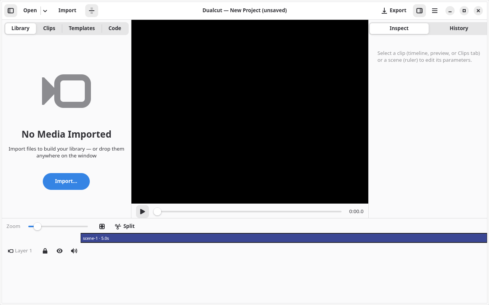
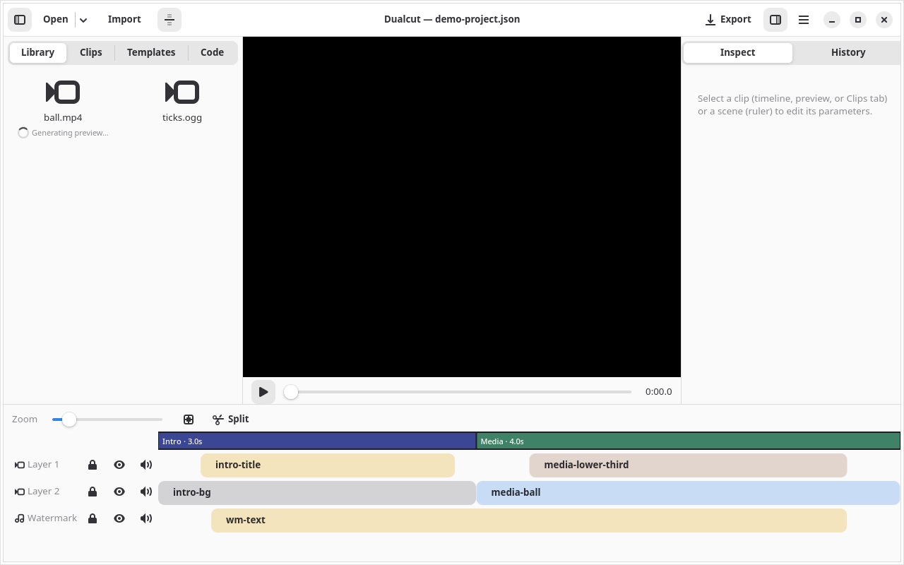
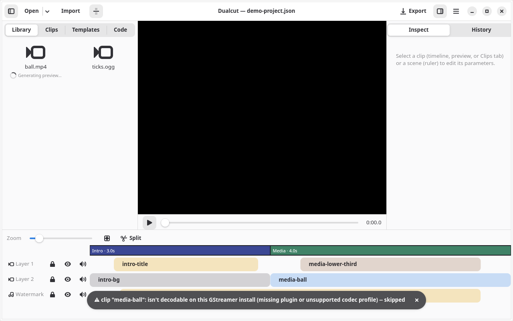
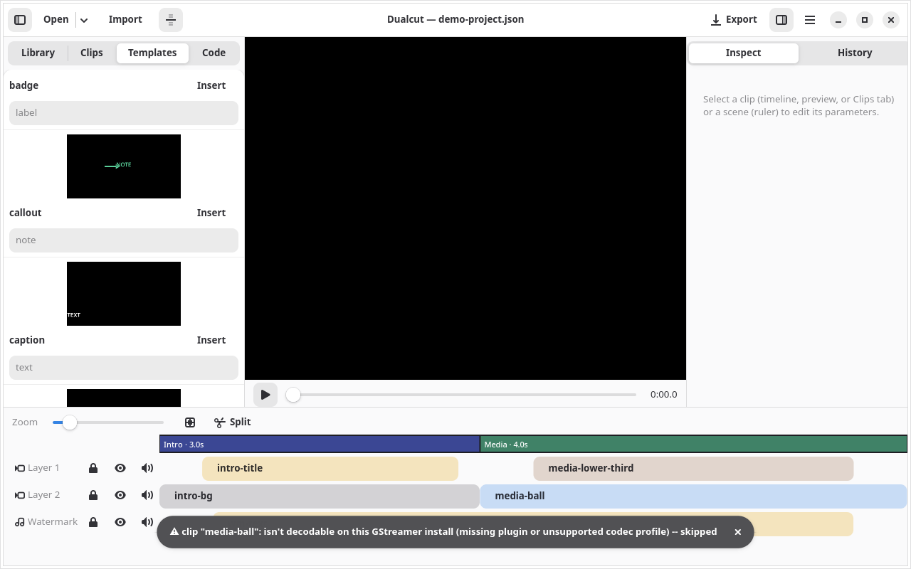
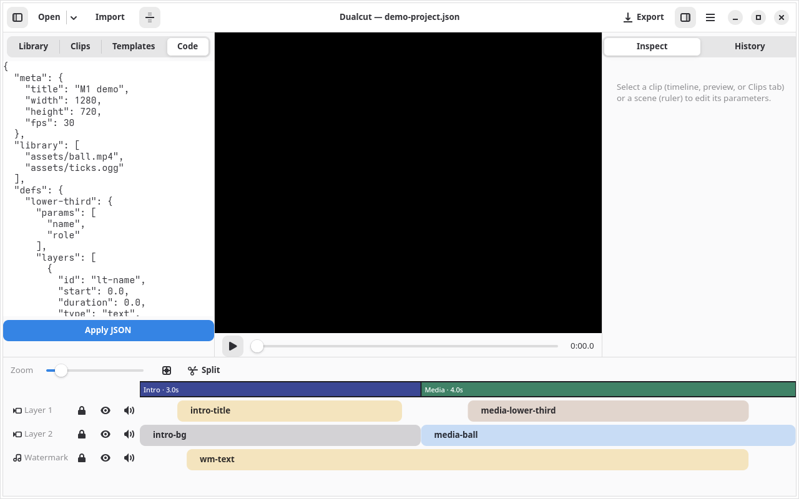
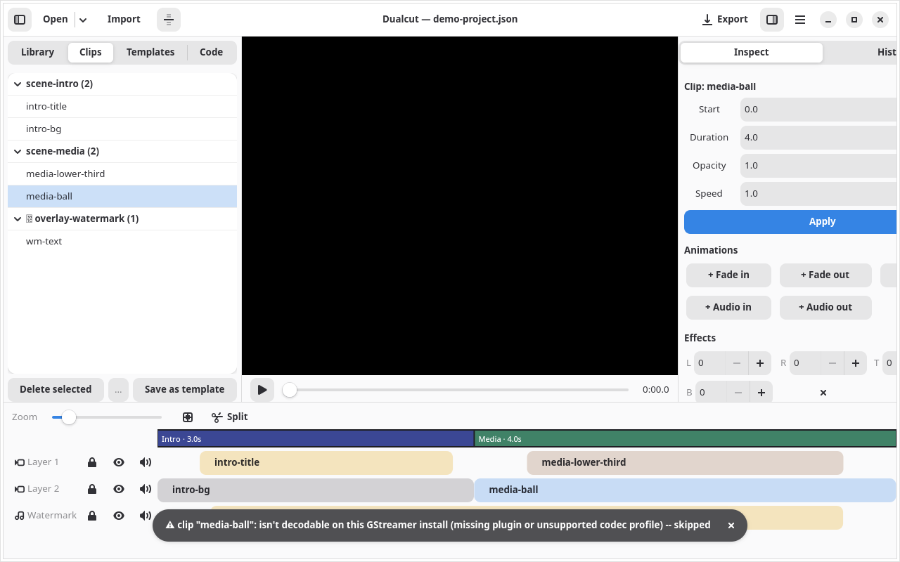
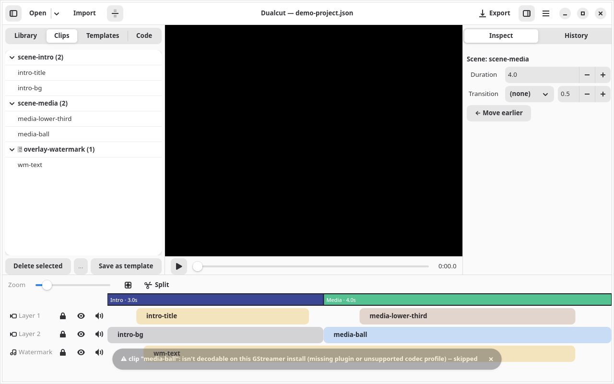
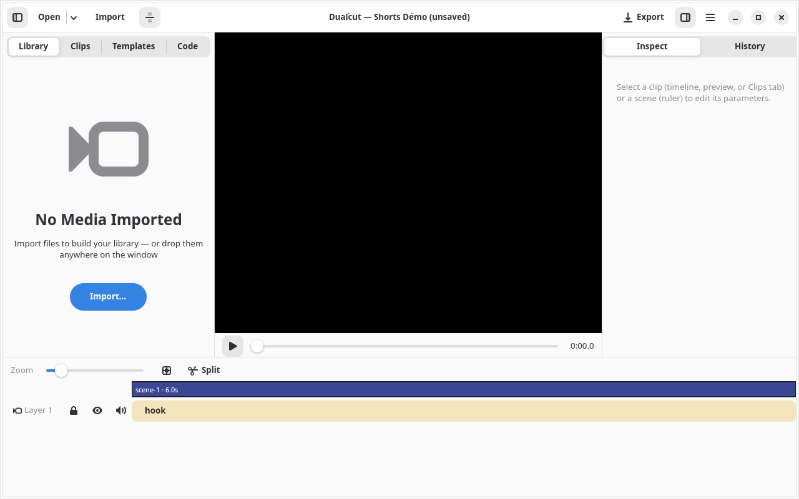
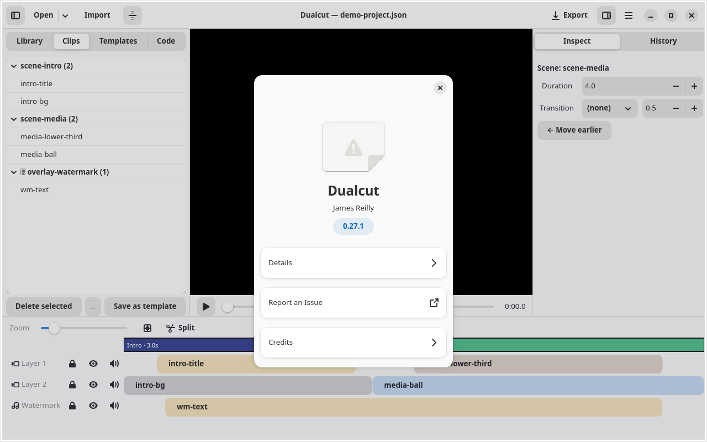

# Dualcut User Guide

Screenshots on this page are regenerated automatically on every release
by `scripts/walkthrough.sh` (the app's `DUALCUT_WALKTHROUGH` mode), so
they always match the released build.

## Starting out

Launch Dualcut from your app menu and you get an unsaved **New
Project**, scaffolded with a title scene — edit immediately, then pick
a location with *Menu → Save Project As…* (auto-save takes over from
there). Use **Open** for an existing project (the arrow lists recent
ones), or pass a path on the command line: `dualcut project.json`.

## The editor

One window, four regions: the **Clips / Library / Templates / Code /
Script** tabs on the left, the **preview** with transport controls in
the middle, the **Inspector** (parameters for whatever is selected) on
the right, and the **timeline** in a bottom pane you can toggle from
the header bar.

Transport shortcuts: **Space** play/pause, **←/→** frame-step,
**Home** rewind, **Ctrl+Z / Ctrl+Shift+Z** undo/redo.

## Library

**Import** (header or the Library tab's empty state) adds media files
to the project's library — or just drag files from your file manager
and drop them anywhere on the window. Double-click a thumbnail to insert it into
the scene under the playhead; right-click for *Add to Timeline* /
*Remove from Library*.

Imported videos are automatically transcoded in the background into
lightweight **proxy media** (960px-wide, every frame a keyframe) stored
in the project's `.dualcut-cache/` folder. The preview and timeline
scrub through these proxies for smooth playback even with 4K footage,
while exports always render from the original files at full quality.
Turn this off with *Use proxy media* in Preferences.

## Templates

Every reusable composition (def) in the project appears here with a
rendered preview. Fill in the parameter fields and press *Insert* to
instantiate it at the playhead. Ship your own by selecting clips and
using *Save as template*.

## Code view

The live project JSON — the document itself. Edit it directly and
press *Apply JSON*; the change is validated, undoable, and hot-reloads
the preview, exactly as if an agent had edited the file on disk.

## Script

Where Code shows the document, Script *transforms* it: write a
TypeScript function `export function edit(project: Project): Project`,
press *Run script*, and the returned project becomes the new document
(undoable like any other edit). Useful for bulk operations — renaming
scenes, retiming clips, generating layers from data.

## Editing clips

Select a clip in the timeline, preview, or Inspect list to edit its
timing, transform, and text; add animation presets (fades, slides,
audio fades) or hand-tune keyframes per property; stack **effects**
(blur, color adjustment, chroma key, crop, freeform shape mask, audio EQ,
compressor, and denoise) with live parameter controls. Effects that do not
apply to the selected clip type are skipped with a render warning.

Video and audio clips also have a **playback rate** control. Use a constant
rate for a uniform speed change, or add two or more `rate` keyframes for a
speed ramp. Rate ramps are compiled into static-rate segments at the
keyframes, so use keyframes rather than a tween animation for this property.

A freeform shape mask limits a video or test clip to a vector shape, with
optional feathering and inversion. Dualcut bakes the result into an
alpha-channel file under the project's `.dualcut-cache/`; the first preview or
export is therefore slower, while later renders reuse the cached result.

## Scenes and transitions

Click a scene segment in the timeline ruler to edit its duration and the
transition from the previous scene — crossfade, wipes, box, iris, or
clock, with an adjustable overlap. Audio blends across transitions
automatically.

## Vertical / Shorts export

*New Vertical Project (9:16)* in the hamburger menu scaffolds a
1080×1920 portrait canvas for short-form/social export instead of the
usual 1920×1080. Pairs with two starter templates in the Templates
tab: **vertical-center-crop** (scales and centers a single 16:9 source
to fill the portrait frame) and **vertical-top-bottom-split** (stacks
two sources in the top/bottom halves — reaction + gameplay style).
Both are plain composition — transform math on ordinary video clips —
so they work with any project, not just ones started this way.

## Keyboard shortcuts

Space plays/pauses, Left/Right steps one frame, Home/End jumps to the
start/end, S splits the selected clip at the playhead, Delete ripple-deletes
it, and Ctrl+Z/Ctrl+Shift+Z undo/redo. The hamburger menu's *Keyboard
Shortcuts* opens a reference showing whatever is currently bound — see
below.

Every shortcut is rebindable in *Preferences → Keyboard Shortcuts*: click
any shortcut and press the new key combo, or pick a **preset** to match the
muscle memory from another editor (Adobe Premiere Pro, DaVinci Resolve,
Final Cut Pro, or iMovie) in one click. Presets only remap the actions
dualcut actually has — where an app's shortcut assumes a feature dualcut
doesn't have (e.g. iMovie has no dedicated go-to-start/end key), that
action keeps dualcut's own default instead of going unbound.

## Menu

The hamburger menu holds *New Project*, *New Vertical Project (9:16)*,
*Save Project As…*, *Generate
Captions…* (transcribes the project audio locally with whisper.cpp and
lands the segments as styled text clips on a Subtitles overlay track —
works out of the box in the Flatpak, which bundles a `whisper-cli`
binary and a small English speech model; set `DUALCUT_WHISPER_MODEL` to
a different ggml model path to use one other than the bundled tiny.en;
outside the Flatpak, install `whisper-cli`/`whisper-cpp` on your PATH
and set `DUALCUT_WHISPER_MODEL` — the action is greyed out until a
whisper binary and model are found), *Install Agent Skills…* (sets up
the dualcut skill for coding agents in `~/.agents/skills`,
`~/.claude/skills`, or a directory of your choice), and *About*.

## Working with agents

Everything above has a programmatic twin: the project file hot-reloads
when edited on disk, an HTTP API listens on port 7357, and TypeScript
scripts (`export function edit(p: Project): Project`) run from the
Script tab or the API. See [AGENTS.md](../AGENTS.md) for the document
format and [CONTEXT.md](../CONTEXT.md) for the domain glossary.
